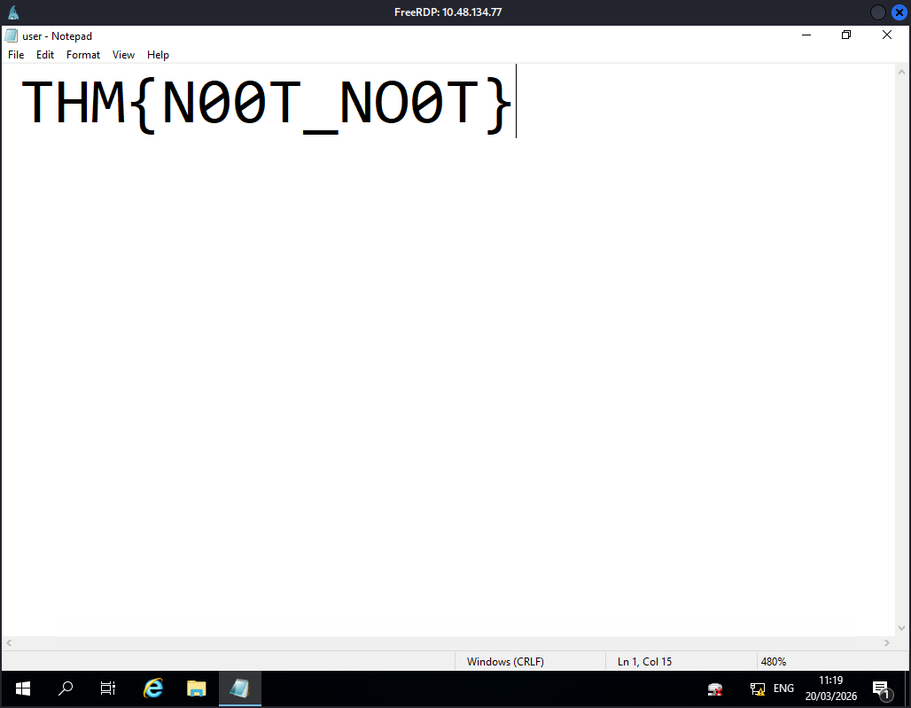
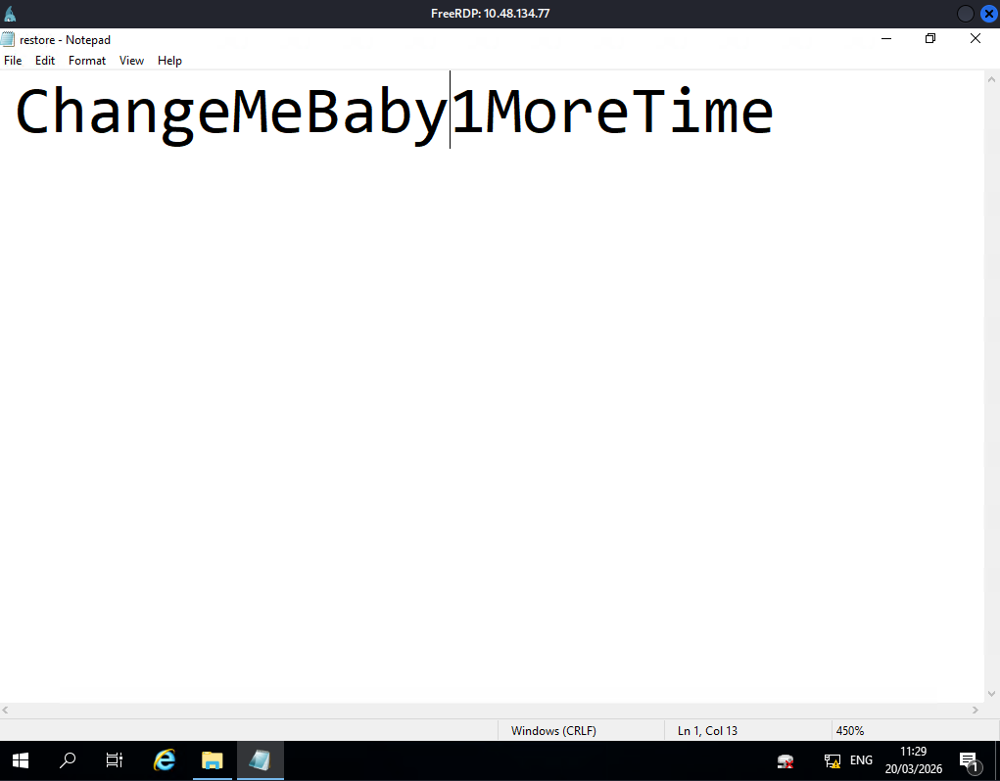
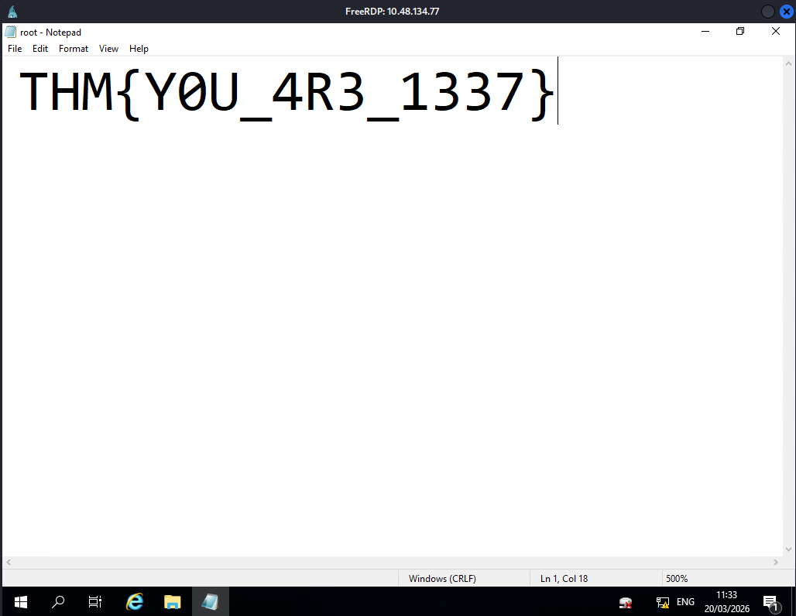

# CTF Write-Up: [Anthem](https://tryhackme.com/room/anthem)

> **Platform:** TryHackMe | **Difficulty:** Easy

---

## 🚩 Answers

---

### Task 1

<details><summary>Q2 : What port is for the web server?</summary><code>80</code></details>
<details><summary>Q3 : What port is for the remote desktop service?</summary><code>3389</code></details>
<details><summary>Q4 : What is a possible password found in a page web crawlers check for?</summary><code>UmbracoIsTheBest!</code></details>
<details><summary>Q5 : What CMS is the website using?</summary><code>Umbraco</code></details>
<details><summary>Q6 : What is the domain of the website?</summary><code>anthem.com</code></details>
<details><summary>Q7 : What is the name of the Administrator?</summary><code>Solomon Grundy</code></details>
<details><summary>Q8 : Can we find the email address of the Administrator?</summary><code>SG@anthem.com</code></details>

---

### Task 2

<details><summary>Flag 1</summary><code>THM{L0L_WH0_US3S_M3T4}</code></details>
<details><summary>Flag 2</summary><code>THM{G!T_G00D}</code></details>
<details><summary>Flag 3</summary><code>THM{L0L_WH0_D15}</code></details>
<details><summary>Flag 4</summary><code>THM{AN0TH3R_M3TA}</code></details>

---

### Task 3

<details><summary>Q2 : Gain initial access to the machine. What is the contents of user.txt?</summary><code>THM{N00T_NO0T}</code></details>
<details><summary>Q3 : Can we spot the admin password?</summary><code>ChangeMeBaby1MoreTime</code></details>
<details><summary>Q4 : Escalate your privileges to root. What is the contents of root.txt?</summary><code>THM{Y0U_4R3_1337}</code></details>

---

## 1. Reconnaissance

### Initial Nmap Scan

```bash
nmap -vv -oN Nmap/Initial -Pn -T5 <IP_ADDRESS>
```

```
PORT     STATE SERVICE
80/tcp   open  http
3389/tcp open  ms-wbt-server
```

### Detailed Nmap Scan

```bash
nmap -vv -oN Nmap/Detailed -Pn -p 80,3389 -A <IP_ADDRESS>
```

| Port | Service | Version | Notes |
|------|---------|---------|-------|
| 80 | HTTP | Microsoft HTTPAPI httpd 2.0 | IIS 10.0 — Umbraco CMS blog; `robots.txt` exposes 4 disallowed paths |
| 3389 | RDP | Microsoft Terminal Services | Windows Server 2019; certificate CN: `WIN-LU09299160F` |

The HTTP title returned **"Anthem.com - Welcome to our blog"**. `robots.txt` exposed the CMS structure with disallowed entries pointing to `/umbraco/`, confirming the site runs **Umbraco CMS**. OS fingerprinting identified **Windows Server 2019**, with RDP accessible directly on port 3389.

### Web Enumeration

#### robots.txt

`http://<IP_ADDRESS>/robots.txt`

```
UmbracoIsTheBest!

# Use for all search robots
User-agent: *

# Define the directories not to crawl
Disallow: /bin/
Disallow: /config/
Disallow: /umbraco/
Disallow: /umbraco_client/
```

The string `UmbracoIsTheBest!` sits at the top of `robots.txt` outside any directive syntax — a plaintext credential left in a public file.

#### Technology Fingerprinting (Wappalyzer)

| Category | Detail |
|----------|--------|
| Web Server | IIS 10.0 |
| OS | Windows Server |
| JS Library | jQuery 1.11.0 |
| CDN | Google Hosted Libraries |

---

## 🔍 Answer Details

### Task 1

**Q2 : Web server port**
Nmap returned port 80 running Microsoft HTTPAPI / IIS 10.0 serving the Anthem blog.

**Q3 : RDP port**
Nmap identified `ms-wbt-server` on port 3389 with a valid TLS certificate issued to `WIN-LU09299160F`, confirming Microsoft Terminal Services.

**Q4 : Password in robots.txt**
The string `UmbracoIsTheBest!` was found at the very top of `robots.txt`, outside any directive syntax — a plaintext credential in a public-facing file.

**Q5 : CMS**
`robots.txt` disallowed `/umbraco/` and `/umbraco_client/`, directly revealing the CMS name. Umbraco is a well-known .NET-based open source CMS.

**Q6 : Domain**
Nmap resolved the target IP to `anthem.com` during the scan. The blog title and all internal links confirmed this.

**Q7 : Administrator name**
A blog post at `/archive/a-cheers-to-our-it-department/` contained a poem about the administrator — a traditional English nursery rhyme about **Solomon Grundy** (first recorded 1842). A quick Google search of the opening line confirmed the name immediately.

**Q8 : Administrator email**
A post at `/archive/we-are-hiring/` was authored by **Jane Doe** with contact email `JD@anthem.com`, establishing the pattern: first initial + last initial @ domain. Applied to Solomon Grundy → `SG@anthem.com`.

---

### Task 2

**Flag 1 : Open Graph meta tag** (`/archive/we-are-hiring/`)
Found in the `og:description` meta tag — invisible in the rendered view, visible only in page source.

```
view-source:http://<IP_ADDRESS>/archive/we-are-hiring/
```

```html
<meta content="THM{L0L_WH0_US3S_M3T4}" property="og:description" />
```

**Flag 2 : Search input placeholder** (`/archive/we-are-hiring/`)
Found in the `placeholder` attribute of the search input field on the same page — visible in source.

```html
<input type="text" name="term" placeholder="Search... THM{G!T_G00D}" />
```

**Flag 3 : Author profile website field** (`/authors/`)
Visible directly in the browser — Jane Doe's website field displayed the flag as link text with no source inspection needed.

**Flag 4 : Open Graph meta tag** (`/archive/a-cheers-to-our-it-department/`)
Found in the `og:description` tag of the admin poem post — same placement as Flag 1, different page.

```
view-source:http://<IP_ADDRESS>/archive/a-cheers-to-our-it-department/
```

```html
<meta content="THM{AN0TH3R_M3TA}" property="og:description" />
```

---

### Task 3

#### Initial Access — RDP

With `SG` as the username (`SG@anthem.com`) and `UmbracoIsTheBest!` as the password, RDP access was attempted directly:

```bash
xfreerdp /v:<IP_ADDRESS> /u:SG /p:'UmbracoIsTheBest!'
```

The credentials were accepted immediately. A full desktop session as user **SG** was established — credentials from `robots.txt` worked directly, no exploitation required.

✅ **RDP session as `SG`.**

#### User Flag

```
C:\Users\SG\Desktop\user.txt
```



```
THM{N00T_NO0T}
```

#### Privilege Escalation — Hidden File & ACL Abuse

`SG` had no administrative privileges. A backup directory at `C:\backup\` was found containing `restore.txt` — initially inaccessible, with permissions restricted to the Administrator account.

**Step 1 : Enable Hidden Files**
Hidden files were made visible via **File Explorer → View → Hidden items**, revealing `restore.txt` in `C:\backup\`.

**Step 2 : Grant Read Permissions via ACL**
`SG` lacked read rights on `restore.txt`. Permissions were modified through the GUI:

1. Right-click `restore.txt` → **Properties**
2. Navigate to **Security** tab → **Edit**
3. Click **Add** → enter user `SG` → confirm
4. Grant **Read** permission → **Apply**

**Step 3 : Read the Credential**
Opening `restore.txt` in Notepad revealed the plaintext Administrator password:



```
ChangeMeBaby1MoreTime
```

**Step 4 : Access Administrator Desktop**
Navigated to `C:\Users\Administrator\`. UAC prompted for elevated credentials — `ChangeMeBaby1MoreTime` was entered.

✅ **Administrator access obtained.**

#### Root Flag

```
C:\Users\Administrator\Desktop\root.txt
```



```
THM{Y0U_4R3_1337}
```

---

## 2. Compromise Overview

```
Nmap Scan
    └─► Port 80 (IIS / Umbraco CMS), Port 3389 (RDP — Windows Server 2019)

robots.txt enumeration
    └─► Plaintext password discovered: UmbracoIsTheBest!
    └─► CMS identified: Umbraco → /umbraco/ admin path confirmed

Blog post OSINT (/a-cheers-to-our-it-department/)
    └─► Nursery rhyme → Solomon Grundy → Admin name identified

Email pattern from /we-are-hiring/ (JD@anthem.com)
    └─► Admin email derived: SG@anthem.com → RDP username: SG

xfreerdp with SG:UmbracoIsTheBest!
    └─► RDP session established → user.txt: THM{N00T_NO0T}

C:\backup\restore.txt (hidden, restricted ACL)
    └─► Hidden items enabled → file revealed
    └─► ACL modified to grant SG read access
    └─► Plaintext admin password: ChangeMeBaby1MoreTime

C:\Users\Administrator\Desktop\root.txt
    └─► UAC elevation with ChangeMeBaby1MoreTime → root.txt: THM{Y0U_4R3_1337}
```

---

## 3. Vulnerabilities & Mitigations

| # | Vulnerability | Impact | Mitigation |
|---|---------------|--------|------------|
| 1 | Plaintext password stored in `robots.txt` | Credential harvested with no authentication required | Never store credentials in public-facing files; use a secrets manager |
| 2 | Admin identity derivable from public blog content | Username (`SG`) enumerated via OSINT with no tooling | Avoid publishing personal details of privileged accounts; use pseudonyms for admin authors |
| 3 | Predictable email-based username convention | RDP login possible with a guessable username | Use non-personally-derived account names for privileged accounts |
| 4 | RDP exposed on a public-facing port | Direct credential stuffing or brute-force surface | Restrict RDP to VPN or internal networks; enforce NLA and account lockout |
| 5 | Plaintext Administrator password in `C:\backup\restore.txt` | Full privilege escalation once read access was obtained | Encrypt sensitive files at rest; restrict backup ACLs to Administrator only |
| 6 | Low-privileged user able to self-modify ACLs on sensitive files | `SG` granted itself read access to the admin credential file | Enforce strict ACL inheritance; audit and restrict `Write DAC` permissions for standard users |

---

*Anthem — TryHackMe | Rooted ✅*