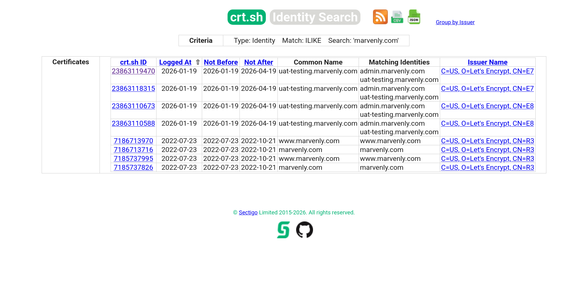
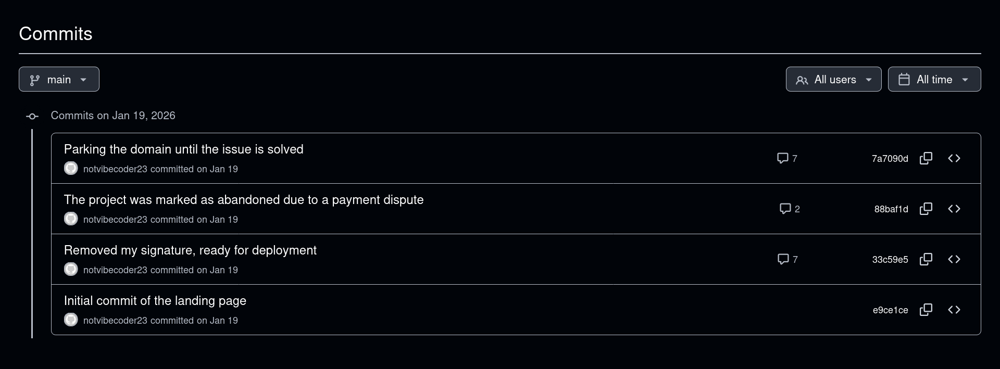
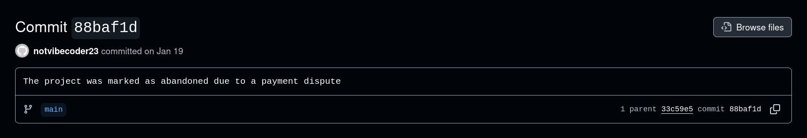

# CTF Write-Up: [Dev Diaries](https://tryhackme.com/room/devdiaries)

> **Platform:** TryHackMe | **Difficulty:** Easy

---

## 🚩 Answers

<details>
<summary>Q1 : Development Subdomain</summary>

`uat-testing.marvenly.com`

</details>

<details>
<summary>Q2 : GitHub Username</summary>

`notvibecoder23`

</details>

<details>
<summary>Q3 : Developer Email</summary>

`freelancedevbycoder23@gmail.com`

</details>

<details>
<summary>Q4 : Reason for Removing Source Code</summary>

`The project was marked as abandoned due to a payment dispute`

</details>

<details>
<summary>Q5 : Hidden Flag</summary>

`THM{g1t_history_n3v3r_forg3ts}`

</details>

---

## 1. Subdomain Discovery — crt.sh

Standard subdomain brute-forcing and Wayback Machine lookups returned nothing useful. **Certificate Transparency logs** did.

Querying [`crt.sh`](https://crt.sh/?q=marvenly.com) for all certificates issued to `marvenly.com` revealed a non-production subdomain:



> **Q1 Answer — Development subdomain:** `uat-testing.marvenly.com`

---

## 2. Developer Identification — Site Footer

Visiting [`uat-testing.marvenly.com`](http://uat-testing.marvenly.com) and scrolling to the footer revealed a developer attribution credit:


Searching GitHub for [`notvibecoder23`](https://github.com/notvibecoder23/) confirmed an account with a repository named `marvenly_site`.

> **Q2 Answer — GitHub username:** `notvibecoder23`

---

## 3. Email Address — Git Log

Cloning the repository and inspecting the commit history exposed the developer's email address directly in the author metadata:

```bash
git clone https://github.com/notvibecoder23/marvenly_site.git
cd marvenly_site
git log
```

```
commit 7a7090dd0ce6b8932d0c4a44e050e7fa1e0b2edd (HEAD -> main, origin/main, origin/HEAD)
Author: notvibecoder23 <freelancedevbycoder23@gmail.com>
Date:   Tue Jan 20 00:38:53 2026 +0800
    Parking the domain until the issue is solved

commit 88baf1db29d7530a51c7bc13ae9f3c1b9a1eae25
Author: notvibecoder23 <freelancedevbycoder23@gmail.com>
Date:   Tue Jan 20 00:33:16 2026 +0800
    The project was marked as abandoned due to a payment dispute

commit 33c59e5feedcbcbfee7a1f6d3a435225698f616f
Author: notvibecoder23 <freelancedevbycoder23@gmail.com>
Date:   Tue Jan 20 00:32:28 2026 +0800
    Removed my signature, ready for deployment

commit e9ce1cebf3182472f729d976bf04b5d8e35b9b32
Author: notvibecoder23 <freelancedevbycoder23@gmail.com>
Date:   Tue Jan 20 00:12:43 2026 +0800
    Initial commit of the landing page
```

> **Q3 Answer — Developer email:** `freelancedevbycoder23@gmail.com`

---

## 4. Reason for Abandonment — Commit History

Reviewing the [commit list](https://github.com/notvibecoder23/marvenly_site/commits/main/) on GitHub told the story of the project's fate at a glance.



Commit [`88baf1d`](https://github.com/notvibecoder23/marvenly_site/commit/88baf1db29d7530a51c7bc13ae9f3c1b9a1eae25) made the reason explicit:



> **Q4 Answer:** `The project was marked as abandoned due to a payment dispute`

---

## 5. Hidden Flag — Deleted HTML Comment

The most revealing commit is [`33c59e5`](https://github.com/notvibecoder23/marvenly_site/commit/33c59e5feedcbcbfee7a1f6d3a435225698f616f) — *"Removed my signature, ready for deployment"*. Examining the diff shows that while the visible footer credit was deleted, it was replaced with an HTML comment the developer left as a hidden signature:

```diff
- <p>Website developed by notvibecoder23</p>
+ <!-- removed the signature, but I'm leaving something as my hidden signature THM{g1t_history_n3v3r_forg3ts} -->
```

> **Q5 Answer — Hidden flag:** `THM{g1t_history_n3v3r_forg3ts}`

---

## 6. OSINT Trail

```
marvenly.com (starting point)
    └─► crt.sh certificate transparency logs
            └─► uat-testing.marvenly.com (dev subdomain)

uat-testing.marvenly.com
    └─► Footer → "Website developed by notvibecoder23"
            └─► github.com/notvibecoder23/marvenly_site

git log
    ├─► Author email: freelancedevbycoder23@gmail.com
    ├─► Commit 88baf1d → "abandoned due to a payment dispute"
    └─► Commit 33c59e5 diff → HTML comment → THM{g1t_history_n3v3r_forg3ts}
```

---

*Dev Diaries — TryHackMe | Completed ✅*